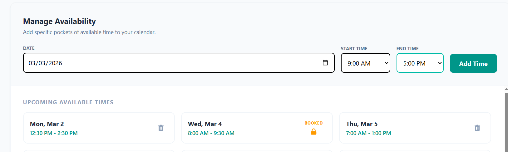
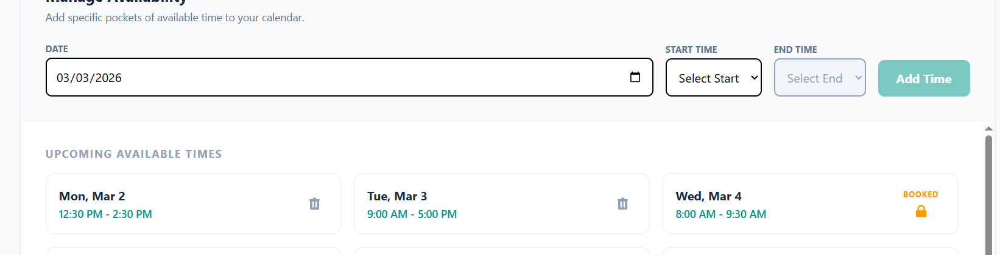
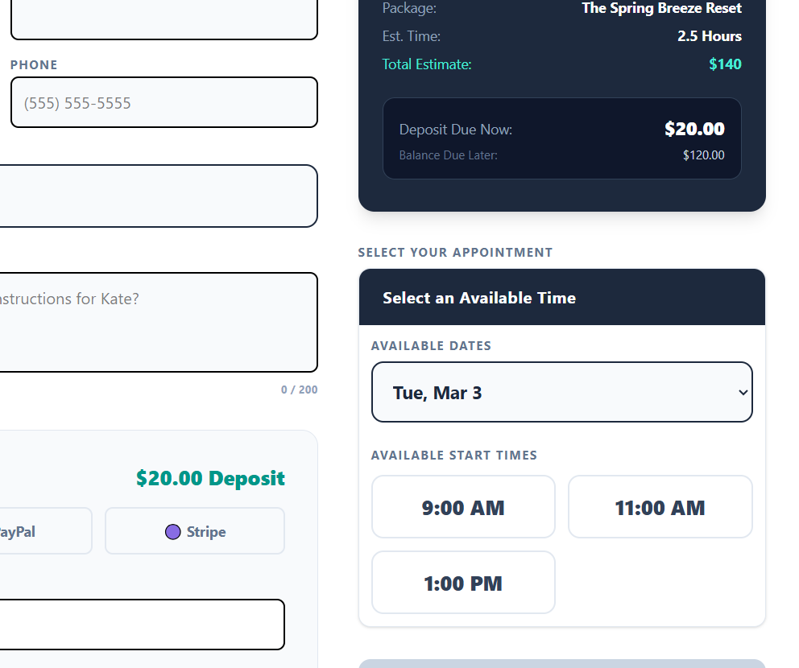
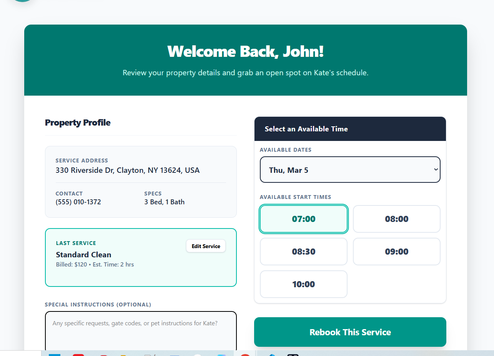
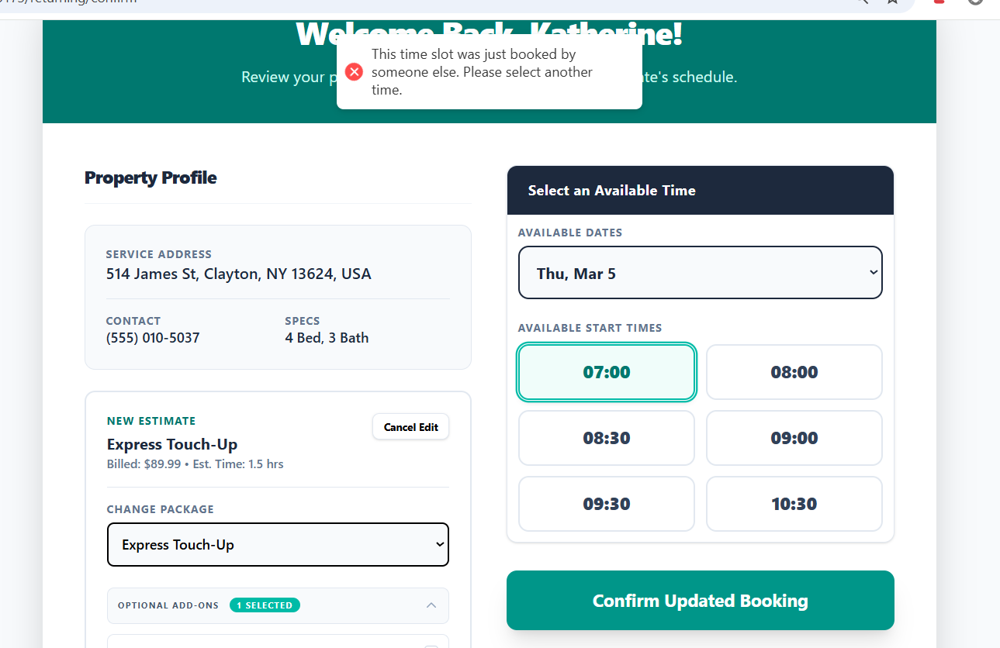
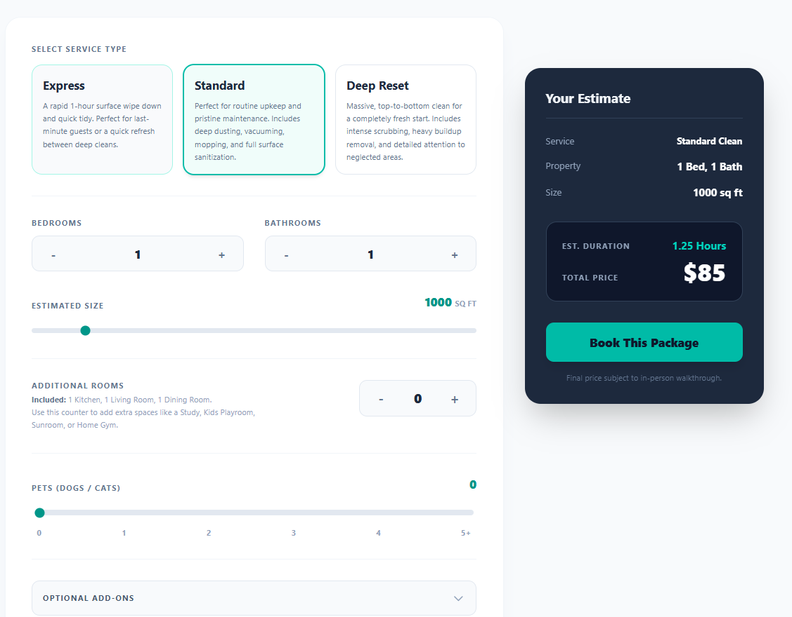
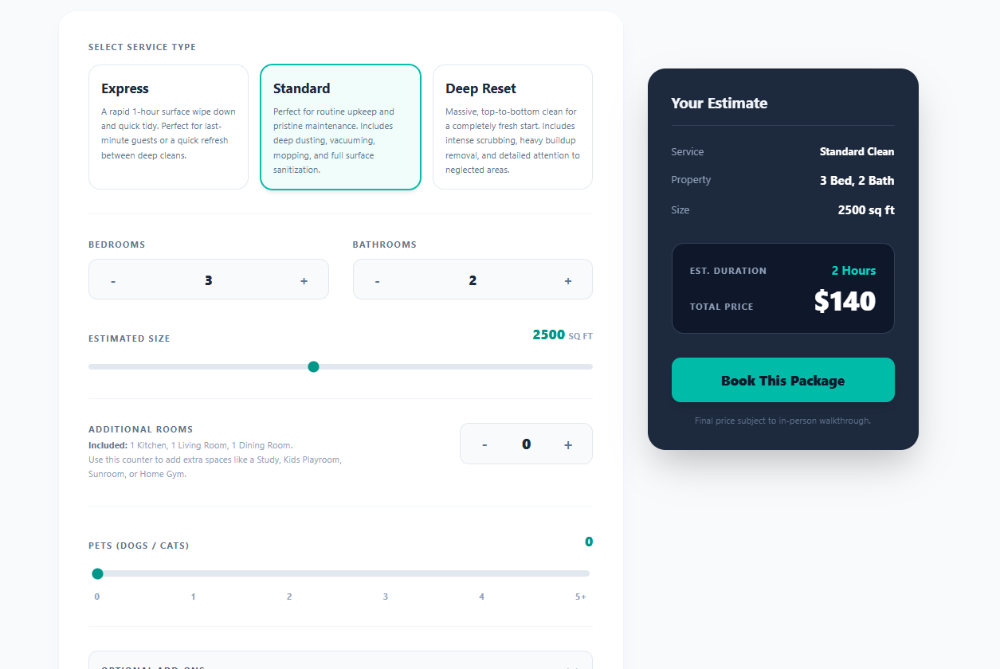

**User Acceptance Testing (UAT) & Quality Assurance Plan**

**Project Name:** River Breeze Domestic Detailing Scheduling & Lead Gen Platform  
**Developer/Tester:** Greg Farrell  
**Date of Testing:** 2026-03-01  
**Project Version/Release:** v1.0 - Production Candidate  

---

### **1. Testing Environment Checklist**
* **Operating Systems Tested:** Windows 11, Android
* **Browsers Tested:** Google Chrome, Microsoft Edge
* **Device Viewports:** * Desktop PC (1920x1080)
    * Mobile - Samsung Galaxy (412x915)

---

### **2. Testing Protocol & Evidence**
* **Goal:** Verify that all Functional and Technical requirements—specifically the Scheduling Engine has been met.
* **Screenshot Protocol:** Every core functionality test **must** be accompanied by a screenshot proving the expected result. Embed screenshots in the "Proof" column using the syntax: ``.
* **Status Codes:** * **PASS:** Feature works exactly as expected.
    * **FAIL:** Feature is broken or produces an error.

---

### **3. Test Cases**

**Phase 1: Scheduling Logic (Smart Anchor Engine v2.0)**

| ID | Feature | Steps to Execute | Expected Result | Pass/Fail | Proof |
| :--- | :--- | :--- | :--- | :--- | :--- |
| **SCH-01** | 120-Minute Stepping | Create an empty 9:00 AM - 5:00 PM shift. Search for a 2.75 hr footprint (2.5h job + 15m buffer). | Engine displays slots exactly 2 hours apart starting from the shift start (9:00 AM, 11:00 AM, 1:00 PM). | PASS |    |
| **SCH-02** | Flush Anchoring | With an existing 11:00 AM - 1:45 PM booking, search for a 1.75 hr footprint in the same shift. | Engine anchors exactly to the existing job, displaying 9:15 AM (backward flush) and 1:45 PM (forward flush). | [ ] | [Proof] |
| **SCH-03** | The Squeeze Pass | Search for a 2.25 hr job on a day with exactly 2.25 hrs of contiguous free time remaining. | Engine strips the standard 15-min travel buffer (Pass 2) to successfully "cram" the job into the exact remaining space. | [ ] | [Proof] |
| **SCH-03** | Race Condition | Open two browsers. Book the same slot on Browser A, then immediately on Browser B. | Browser B is rejected by the Real-Time Security Check with "Slot was just booked" error. | [ ] | |

**Phase 2: Lead Gen & Conditional Checkout**

| ID | Feature | Steps to Execute | Expected Result | Pass/Fail | Proof |
| :--- | :--- | :--- | :--- | :--- | :--- |
| **LGN-01** | Quote Engine | Input property specs (e.g., 2500 sqft, 3 beds, 2 baths) into the calculator. | Price and Est. Time update instantly based on specific algorithms. | [ ] |   |
| **LGN-02** | Deposit Flow | As a "New Client," complete the booking form and proceed to checkout. | Routing forces a $20 non-refundable credit card deposit before confirmation. | [ ] | [Proof] |
| **LGN-03** | Magic Reveal | Verify identity as a "Returning Client" with address + phone. | App triggers premium CSS clip-path animation and loads past property data. | [ ] | [Proof] |

**Phase 3: Admin Dashboard Operations**

| ID | Feature | Steps to Execute | Expected Result | Pass/Fail | Proof |
| :--- | :--- | :--- | :--- | :--- | :--- |
| **ADM-01** | Shift Security | Attempt to delete an active shift that contains a "Confirmed" appointment. | Deletion blocked; UI displays error requiring cancellation of jobs first. | [ ] | [Proof] |
| **ADM-02** | Job Finalization | Click "Finalize Job" on a past confirmed appointment and add admin notes. | Status updates to "Completed"; notes appear in Client Roster history. | [ ] | [Proof] |
| **ADM-03** | Soft-Archive | Click "Deactivate Client" in the roster view. | Client `isActive` set to false; future jobs are automatically canceled. | [ ] | [Proof] |

**Phase 4: Integrations & Validation**

| ID | Feature | Steps to Execute | Expected Result | Pass/Fail | Proof |
| :--- | :--- | :--- | :--- | :--- | :--- |
| **INT-01** | Google Maps | Type "Main St" without a house number in the address autocomplete. | Autocomplete rejects input; forces selection of an exact house number. | [ ] | [Proof] |
| **INT-02** | Date Validation | Attempt to select a past date in the Availability Manager. | Native HTML `min` attribute grays out all dates before today. | [ ] | [Proof] |

---

### **4. Final Sign-Off**
_By signing below, the developer and client agree that all functional requirements have been tested, proven via screenshot evidence, and are approved for production deployment._

**Developer Signature:** __Greg Farrell__ **Date:** _3/2/2026_

**Client Signature:** ______________________________ **Date:** ____________